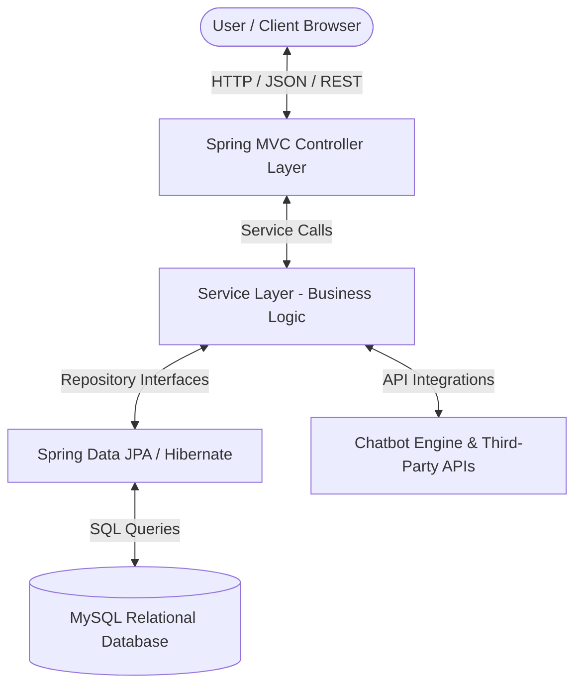

# GARAGE.LK: GARAGE FINDER
### Project Proposal | BSc in Software Engineering

**Student Details:**  
* **Name:** Hiran Poornajith Weragoda  
* **Student ID:** KD/BSCSD/21/38  

---

## Table of Contents
1. [Title](#1-title)
2. [Introduction](#2-introduction)
3. [Current Situation Leading to Problem Identification](#3-current-situation-leading-to-problem-identification)
4. [Proposed Technique to Solve the Current Problem](#4-proposed-technique-to-solve-the-current-problem)
5. [Feasibility](#5-feasibility)
   - [Technical Feasibility](#technical-feasibility)
   - [Operational Feasibility](#operational-feasibility)
   - [Economic Feasibility](#economic-feasibility)
6. [Project Description](#6-project-description)
   - [Architecture Diagram](#architecture-diagram)
   - [Multi-Tier Role-Based Architecture](#multi-tier-role-based-architecture)
7. [Deliverables and Time Plan for Implementation](#7--10-deliverables-and-time-plan-for-implementation)
8. [Resources Required](#8-resources-required)
   - [Software & IDE Resources](#software--ide-resources)
   - [Language, Frameworks & Core Libraries](#language-frameworks--core-libraries)
   - [Frontend & Communication Resources](#frontend--communication-resources)
   - [Hardware Resources](#hardware-resources)
9. [Expected Output and Outcome](#9-expected-output-and-outcome)
   - [Expected Output](#expected-output)
   - [Expected Outcome](#expected-outcome)
10. [Limitations](#11-limitations)
11. [References](#references)

---

## 1. Title
**Garage.lk: An Intelligent, Crowdsourced Marketplace for Spare Parts and Vehicle Maintenance**

---

## 2. Introduction
Owning a car is crucial for both daily living and business logistics in Sri Lanka's quickly growing economy. Nonetheless, the vehicle maintenance and aftermarket industry is still very dispersed, causing inconsistencies in service delivery and customer satisfaction [9]. Owners of automobiles frequently struggle to find trustworthy mechanics, correctly identify unexpected car problems, and find authentic replacement parts at reasonable, open costs. 

A complete online platform called **Garage.lk** was created to close this gap between car owners, repair providers, and suppliers of spare parts. By centralizing these services, the platform removes market inefficiencies and establishes a tech-driven, transparent, and highly efficient automotive ecosystem that simplifies maintenance and part procurement across the country [7].

---

## 3. Current Situation Leading to Problem Identification
There are several operational obstacles in Sri Lanka's modern automotive care industry:

* **Information Asymmetry:** The majority of car owners are not trained in technical mechanics. This makes them extremely susceptible to erroneous breakdown diagnostics from unreliable repair businesses or arbitrary, exaggerated prices [1].
* **Extremely Disjointed Supply Chain:** Drivers must physically visit or contact numerous physical retail locations in order to source specific spare parts, which causes significant delays and productivity losses.
* **Lack of Reactive-to-Predictive Care:** Reactive breakdown repairs are nearly the only option available to drivers. There isn't a systematic tracking technique that enables drivers to anticipate and comprehend the condition or maintenance schedules of their vehicles.
* **No Verified Central Directory:** Instead of an organized database with reliable user reviews, locating specialized assistance (such as a hybrid car technician or a particular brand specialist) in a particular area mostly relies on word-of-mouth [10].

---

## 4. Proposed Technique to Solve the Current Problem
Garage.lk presents an intelligent, networked full-stack online architecture to methodically address the inefficiencies in the existing vehicle maintenance industry. Through the following fundamental methods, this technical solution bridges the gap between all stakeholders by combining strong software engineering principles with astute automation:

1. **Enterprise Full-Stack Architecture:** A high-performance Java backend and the Spring Boot framework underpin the platform's multi-tier architecture. This architecture separates business functionality from the user interface, safely manages operational multi-tier traffic, and guarantees secure user authentication. A relational MySQL database is used to manage data persistence [6]. Strict Object-Oriented Programming (OOP) and SOLID design concepts [3, 12] are used to arrange intricate interactions between users, bookings, and inventories.
2. **24/7 Chatbot Support:** The program incorporates an automated, round-the-clock chatbot system to remove the obstacle of information asymmetry and offer ongoing support. This feature functions as a virtual assistant that smoothly leads customers through the platform [8], assisting them in locating the precise mechanical services they need or sourcing extra equipment and specialized car tools without requiring human customer service assistance.
3. **E-Commerce Spare Parts Marketplace:** The platform presents a regional B2C and B2B e-commerce marketplace that links customers and spare parts suppliers directly [7]. Both car owners and qualified mechanics can use this module to quickly look for necessary parts and verify live availability in local spare parts markets. It reduces time waste and simplifies the whole part-procurement process by using geolocation data and real-time inventory synchronization.

---

## 5. Feasibility
To ensure the viability and successful execution of Garage.lk, a comprehensive feasibility study was conducted across three critical dimensions: technical execution, operational integration, and economic sustainability.

### Technical Feasibility
The highly developed, industry-standard technological stack of Java, Spring Boot, Maven, and MySQL is used in the development of Garage.lk.

* **Architectural Integrity:** The system clearly divides data management, business logic, and user interfaces by rigorously adhering to the Model-View-Controller (MVC) design pattern [5]. Updates to the frontend web views won't interfere with backend stability because of this decoupling.
* **Maintainability and Scalability:** SOLID principles and fundamental Object-Oriented Programming (OOP) guidelines [3, 12] are used in the design of the backend code architecture. This guarantees that the source is highly scalable, legible, and modular, enabling the seamless integration of new components as the platform expands.
* **Resource Optimization:** The platform incorporates open-source, cloud-based NLP and automation APIs instead of creating intricate machine learning infrastructures from the ground up. This preserves excellent feature accuracy while drastically reducing complicated internal data training needs and processing overhead.

### Operational Feasibility
Garage.lk provides immediate, explicit, and measurable value to all participating stakeholders within the automotive ecosystem, ensuring high adoption rates:

* **For Car Owners (Drivers):** The platform eliminates the need for traditional guesswork in car maintenance by offering clear options, real-time garage availability, and reliable crowd-sourced ratings [10].
* **For Service Providers (Garages & Spare Part Shops):** Small to medium-sized local businesses can use the program as a specialized digital toolkit to create an online presence. It enables them to effectively handle reservations and sales by reaching customers outside of their own geographic area.
* **Usability:** Because the UI is based on common responsive web technologies [11], individuals with rudimentary computer or smartphone literacy may easily traverse the site.

### Economic Feasibility
The financial development plan for Garage.lk presents minimal risk, ensuring low initial capital expenditure and clear pathways to long-term sustainability:

* **Minimal Upfront Capital:** The project totally avoids costly software license fees during the engineering phase by utilizing fully open-source, free-tier development tools and frameworks, such as IntelliJ IDEA/Visual Studio Code, MySQL [6], and the Spring Framework [2].
* **Hardware Efficiency:** No expensive specialized machinery is required because the entire development process may be carried out on conventional, mid-range hardware computing configurations.
* **Post-Launch Sustainability:** With dependable monetization strategies, the platform may readily cover its operating and hosting expenses after it is put into use. These include premium subscription tiers for high-volume garages, micro-commissions on spare part marketplace transactions [7], and micro-targeted local advertising strategies.

---

## 6. Project Description
Garage.lk is engineered as a robust, multi-tier web application designed to centralize and automate the fragmented automotive ecosystem. The system is structurally built on the Model-View-Controller (MVC) architectural pattern [5], which ensures a clean separation of concerns by isolating the user interface (View) from the operational business logic (Controller) and the underlying data structures (Model).

To achieve long-term maintainability, the application codebase is structured strictly using Object-Oriented Programming (OOP) and SOLID design principles [3], minimizing dependency coupling and making future module expansions seamless.

### Architecture Diagram
The layout below illustrates how data and business logic flow sequentially across the system's structural boundaries:

### Multi-Tier Role-Based Architecture
To manage authentication, data security, and access to specialized features for three primary user types, the system implements explicit role-based access control (RBAC):

#### Customers (Vehicle Owners)
* Access an intuitive frontend dashboard to locate nearby automobile service workshops [10].
* Real-time repair appointment scheduling, modification, and cancellation.
* Use the round-the-clock automated chatbot module to get advice on selecting pertinent car services or locating particular specialized equipment [8].
* View local spare part costs, confirm regional availability, and place direct orders by browsing the online marketplace [7].

#### Service Providers (Garages & Spare Parts Vendors)
* Oversee thorough digital business profiles that include physical location data, specialized service fields (like electrical detailing and hybrid repair), and operating hours.
* Use an appointment-management console to accept, monitor, and update active repair bookings.
* After a task is finished, update the vehicle's service history to provide a verified digital logbook for the owner.
* Oversee a real-time shopfront inventory system on the online marketplace to inform local customers about available replacement parts and their prices [7].

#### System Administrators
* Keep an eye on database transaction performance, server uptime, and overall application health.
* Review, confirm, and approve new garage registrations and vendor profiles to eliminate false listings.
* Moderate community reviews and feedback ratings to preserve a high level of platform trust and transparency [10].

---

## 7 & 10. Deliverables and Time Plan for Implementation

| Task | Deliverables | Time Plan |
| :--- | :--- | :--- |
| **1. Planning** • Scope identification, boundary alignment, and formal template creation. | • Formally approved Project Proposal Document. | Weeks 1 – 2 (14 Days) |
| **2. Requirements Analysis** • Eliciting stakeholder requirements. • Technical identification of framework libraries and integration tools. | • Complete Software Requirements Specification (SRS) Document. • Technical Feasibility Summary Report. | Weeks 3 – 4 (14 Days) |
| **3. System Design** • Modeling data structures, software classes, and UI wireframes. | • Entity-Relationship Diagrams (ERD). • OOP Class Diagrams. • System Architecture Diagrams. • High-Fidelity UI Wireframe Mockups. | Weeks 5 – 7 (21 Days) |
| **4. Development (Coding)** • Building backend MVC endpoints via Spring Boot. • Setting up relational database tables. • Coding responsive frontend layouts. | • Modular Java Backend Source Code Repository. • Live Relational MySQL Database Schema. • Functioning Frontend Client Views. | Weeks 8 – 13 (42 Days) |
| **5. Core System Integration** • Integrating chatbot logic and NLP models. • Developing the localized marketplace search engine. | • Integrated Automated Chatbot Engine. • Live Spare Parts Marketplace Search Module. | Weeks 14 – 17 (28 Days) |
| **6. Testing** • Component unit testing and system integration test execution. | • Formal Test Cases Suite. • Bug Tracking Logs and Validation Reports. | Weeks 18 – 20 (21 Days) |
| **7. Deployment** • Packaging with Maven and hosting online. | • Live Production Web URL (Hosted Platform). • System Deployment Guides & User Installation Manuals. | Weeks 21 – 22 (14 Days) |
| **8. Maintenance** • Bug resolution, system monitoring, and dissertation compiling. | • Performance Evaluation Logs. • Final Academic Project Dissertation Report. | Weeks 23 – 24 (14 Days) |

---

## 8. Resources Required
To successfully execute, program, compile, and validate the Garage.lk web platform, a specific set of development tools, frameworks, and equipment must be mobilized. The technical resource stack is broken down into four foundational areas:

### Software & IDE Resources
* **Primary Integrated Development Environments (IDEs):** IntelliJ IDEA or Eclipse will be used as the central workspace environments for writing, debugging, and compiling backend Java logic and frontend views.
* **Database Management Tool:** MySQL [6] will be deployed as the visual administration interface to construct relational schemas, manage database tables, and run verification scripts.

### Language, Frameworks & Core Libraries
* **Backend Programming Language:** Java SE (Standard Edition) will govern all core programming, leveraging its strong object-oriented features [12] to model real-world business items.
* **Build Automation & Dependency Manager:** Apache Maven will handle project lifecycle execution, automating the download, installation, and compilation of external software libraries.
* **Backend Framework:** Spring Boot [2] will serve as the primary framework, heavily utilizing Spring MVC for request routing, Spring Security for data encryption and user authentication, and Spring Data JPA (Hibernate) for object-relational mapping with the database.

### Frontend & Communication Resources
* **UI Markup & Styling:** Standard web layout design tools including HTML5 for structural elements, CSS3 for styling properties, and Bootstrap 5 [11] as the mobile-responsive grid framework.
* **Client-Side Scripting:** Vanilla JavaScript to implement dynamic interface components and manage asynchronous data transmission.
* **Communication Protocols:** RESTful Web Services APIs [4] handling data transportation back and forth between the client-side frontend and the backend database controllers via standard JSON structures.

### Hardware Resources
* **Development System:** A standard personal computing system or laptop running a minimum of an Intel Core i5 processor (or equivalent AMD Ryzen processor).
* **Memory Capacity:** A minimum of 8GB RAM (16GB recommended) to comfortably run concurrent development instances of the IDE, backend application servers, and local database systems without performance bottlenecks.
* **Storage Allocation:** At least 50GB of available Solid State Drive (SSD) space for software installations, project dependency repositories, and local database testing storage.

---

## 9. Expected Output and Outcome
The outcomes are separated into the tangible software delivery and the practical operational improvements it brings about in order to clearly assess the project's success:

### Expected Output
* Based on an optimized MySQL relational database and a Java Spring Boot backend, this multi-tier web platform is fully operational and ready for production.
* The system incorporates an interactive, round-the-clock automated support chatbot to assist users with mechanical questions and tool acquisition [8].
* Vendors of spare parts can host live inventory lists and prices on a safe, localized e-commerce marketplace [7].
* A web user interface (HTML5, CSS3, JavaScript, Bootstrap) that is completely mobile-responsive [11] and has distinct user pathways for administrators, service providers, and customers.

### Expected Outcome
* **Elimination of Information Asymmetry:** By giving drivers immediate access to clear pricing and validated garage credentials, the consumer regains control [1].
* **Simplified Supply Chain Operations:** Since they can check online for instant availability in nearby spare parts markets, mechanics and automobile owners no longer need to physically drive to look for components [7].
* **Digital Modernization for Small Businesses:** By acquiring a cutting-edge digital toolkit to handle reservations and broaden their market reach, local, independent garages are better equipped to compete fairly in the digital economy.
* **Reduced Vehicle Downtime:** The amount of time a car is left off the road while it is being repaired is significantly decreased by centralizing scheduling and parts procurement.

---

## 11. Limitations
Garage.lk's limits are particular operational, environmental, and data-driven restrictions that can affect the system's performance but are not directly under the system's development control:

* **Accuracy of External Automation & AI Systems:** The training data and third-party NLP APIs used are crucial to the 24/7 automated chatbot's responsiveness and helpfulness [8]. Inaccurate automated recommendations that are beyond the system's control could result from extremely complex mechanical searches or imprecise user descriptions.
* **Dependency on User Data Integrity:** Physical car conditions cannot be independently verified by the platform. Any automated service tracking or reminders will become erroneous if a car owner enters fake service histories or wrong mileage information.
* **Manual Inventory Management by Merchants:** Local merchants must actively update their stock levels and prices on the portal in order for the spare parts marketplace to be accurate in real time [7]. Online customers may encounter data delays that the system application is unable to automatically eliminate if a storefront vendor neglects to register a physical sale.
* **Internet & Access Restrictions:** The application requires constant internet access due to its centralized web paradigm. Real-time marketplace availability and live booking updates will be less accessible to users or mechanics working in remote local regions with inadequate network connection.

---

## References

1. **Akerlof, G. A. (1970).** [The Market for "Lemons": Quality Uncertainty and the Market Mechanism](https://doi.org/10.2307/1879431). *The Quarterly Journal of Economics*, 84(3), 488-500. *(Supports the reduction of Information Asymmetry and repair quality uncertainty in Section 3 & Section 9)*
2. **Webb, P., Syer, D., Wilkinson, P., Depolito, S., Hughes, A., & Teal, M. (2024).** [Spring Boot Reference Guide](https://docs.spring.io/spring-boot/index.html). *VMware Tanzu*. *(Supports backend framework choices and project configurations in Section 5 & Section 8)*
3. **Martin, R. C. (2018).** [Clean Architecture: A Craftsman's Guide to Software Structure and Design](https://www.oreilly.com/library/view/clean-architecture-a/9780134494272/). *Prentice Hall*. *(Supports SOLID principles and layered application architecture in Section 4, Section 5, & Section 6)*
4. **Fielding, R. T. (2000).** [Architectural Styles and the Design of Network-based Software Architectures](https://www.ics.uci.edu/~fielding/pubs/dissertation/top.htm). *Doctoral dissertation, University of California, Irvine*. *(Supports RESTful Web Services APIs design in Section 8)*
5. **Krasner, G. E., & Pope, S. T. (1988).** [A Cookbook for Using the Model-View-Controller User Interface Paradigm in Smalltalk-80](https://doi.org/10.1145/50757.50759). *Journal of Object-Oriented Programming*, 1(3), 26-49. *(Supports the MVC design pattern in Section 5 & Section 6)*
6. **Widenius, M., Axmark, D., & Cole, J. (2002).** [MySQL Reference Manual](https://dev.mysql.com/doc/refman/8.4/en/). *O'Reilly Media*. *(Supports Relational MySQL Database schemas and structures in Section 4, Section 5, & Section 8)*
7. **Turban, E., Outland, J., King, D., Lee, J. K., Liang, T. P., & Turban, D. C. (2018).** [Electronic Commerce 2018: A Managerial and Social Networks Perspective](https://link.springer.com/book/10.1007/978-3-319-58715-8). *Springer*. *(Supports e-commerce marketplace structures and transactions in Section 2, Section 4, Section 5, Section 6, & Section 9)*
8. **Jurafsky, D., & Martin, J. H. (2024).** [Speech and Language Processing (3rd ed. draft)](https://web.stanford.edu/~jurafsky/slp3/). *Stanford University*. *(Supports 24/7 automated chatbot engines and NLP systems in Section 4, Section 6, Section 9, & Section 11)*
9. **Zeithaml, V. A., Berry, L. L., & Parasuraman, A. (1996).** [The Behavioral Consequences of Service Quality](https://doi.org/10.2307/1251929). *Journal of Marketing*, 60(2), 31-46. *(Supports quality of service and standardizations in Section 2)*
10. **Dellarocas, C. (2003).** [The Digitization of Word of Mouth: Promise and Challenges of Online Feedback Mechanisms](https://doi.org/10.1287/mnsc.49.10.1407.17308). *Management Science*, 49(10), 1407-1424. *(Supports the directory search and reputation rating modules in Section 3, Section 5, & Section 6)*
11. **Spurlock, J. (2013).** [Bootstrap: Responsive Web Development](https://www.oreilly.com/library/view/bootstrap/9781449343903/). *O'Reilly Media*. *(Supports UI grids and responsive frontends in Section 5, Section 8, & Section 9)*
12. **Gamma, E., Helm, R., Johnson, R., & Vlissides, J. (1994).** [Design Patterns: Elements of Reusable Object-Oriented Software](https://www.oreilly.com/library/view/design-patterns-elements/0201633612/). *Addison-Wesley*. *(Supports Java programming and pattern-based software architectures in Section 4, Section 5, & Section 8)*
